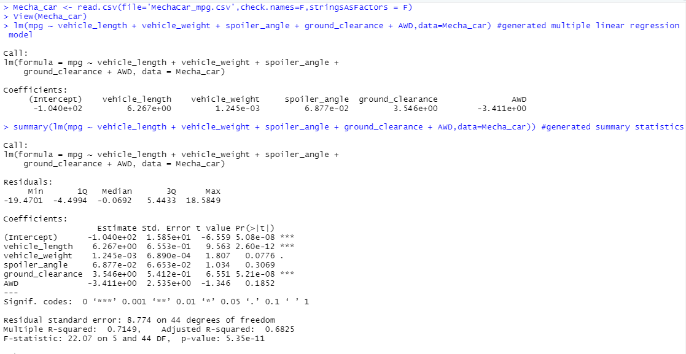
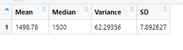
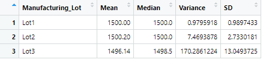
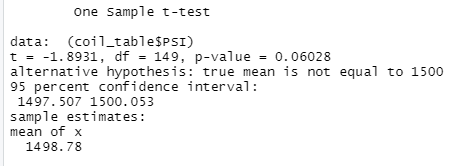
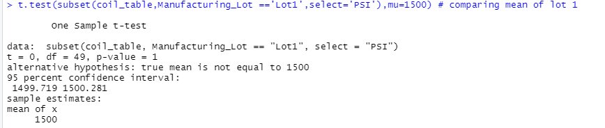
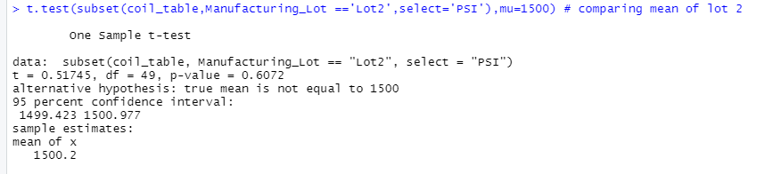
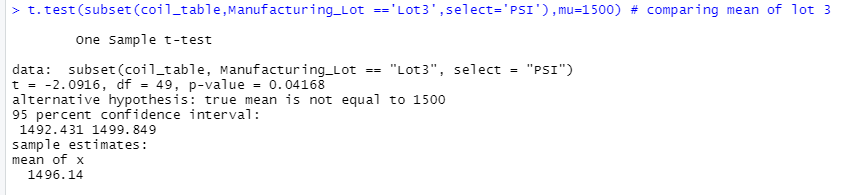

# **MechaCar Statistical Analysis**

This project is about the prototype of "MechaCar" and consist of data from the manufacturing of different lots. We have analyzed the data using 'R' and answered few questions including designing a new statistical study about the comparison of MechaCar and its competition.

## **Linear Regression to Predict MPG**

Below is the screenshot of the summary statistics:

* As evident from the above snippet, the probability values of the variables "Vehicle Length" and "Ground Clearance" are much smaller from our significant value of 0.05. These variables provide non random amount of variance to MPG values.

* The p-value is 5.35e-11 which is much smaller than our assumed significance value of 0.05 therefore we have sufficient evidence that slope of our linear model is not 0.

* The r-squared value is 0.7 which predicts that future data points will fit to our linear model hence we can say that this model effectively predcits the MPG of MechaCar prototypes.

## **Summary Statistics on Suspension Coils**

Below are the screen shots of total_summary and lot_summary tables.

**total_summary**

**lot_summary**

The above snippets show that the variance of all manufacturing lots is 62.3 which is lower than the accepted level of 100 so overall it meets the design specification.

Same is the case with lot 1 and lot 2 however the variance of lot 3 is 170 which is higher than the acceptable level. So we can say that the lot 1 and lot 2 meet the design specification but the lot 3 doesn't meet the specification level.

## **T-Tests on Suspension Coils**

We have performed the T-tests of whole data set and the individual lots and below are the screen shots of the results:

### **Sample T-Test of Whole Data**

The important thing to notice in the above snippet is the p-value of 0.06 which is higher than the assumed significance level of 0.05 therefore we dont have sufficient evidence to reject our null hypothesis and we would say that the two means are statistically similar.

### **Sample T-Test for Each Lot**

### **Lot 1**

The p-value of Lot 1 is '1' which is higher than the assumed significance level of 0.05 therefore we dont have sufficient evidence to reject our null hypothesis and we would say that the two means are statistically similar.

### **Lot 2**

The p-value of Lot 2 is '0.6072' which is higher than the assumed significance level of 0.05 therefore we dont have sufficient evidence to reject our null hypothesis and we would say that the two means are statistically similar.

### **Lot 3**

The p-value of Lot 3 is '0.042' which is slightly lower than the assumed significance level of 0.05 therefore we would say that the two means are slightly different.

## **Study Design: MechaCar vs Competition**

In our study to quantify the performance of MechaCar against the competition, we will study the *fuel consumption* of the vehicles in the city area since this is one of the most important factors for the city commuters. In this study, we will take the MPG (Miles Per Gallon) values in the city area of MechaCar and its competition.

So the metric to be tested is "MPG".

Our alternate hypothesis will be:

*MechaCar consumes less fuel in its category of vehicles*

We would use following statistical tests and the data to be used:

* Fuel consumption of MechaCar and its competition at different driving conditions like at 10 mph , 50 mph and consumption at acceleration to check the MPG of each vehicle and then check the summary statistics to see Mean, Median and Std deviation.
* Two sample T-test: We would specifically look into the p-value to check is there any statistical difference between the means of two samples (MechaCar and Competition)

